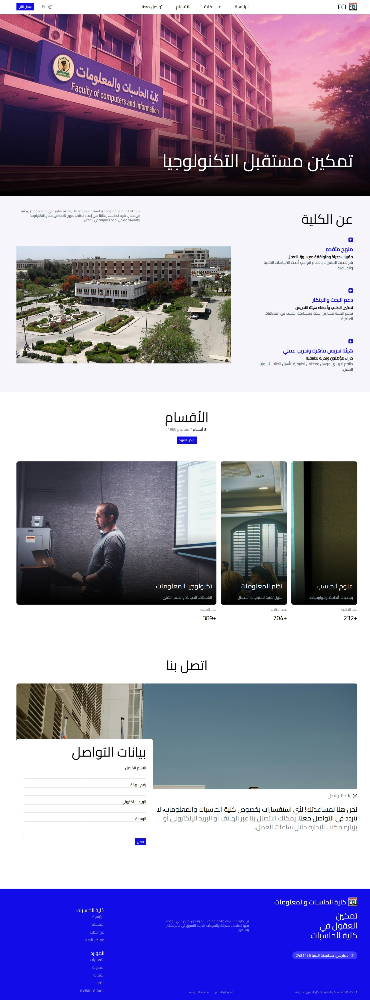

# FCI - Minia University

## Table of contents

- [Overview](#overview)
  - [The challenge](#the-challenge)
  - [Screenshot](#screenshot)
  - [Links](#links)
- [My process](#my-process)
  - [Built with](#built-with)
- [Author](#author)

## Overview

### The challenge

Your task is to design and build a clean, responsive landing page that introduces the Faculty of Computers and Information - Minia University in
a professional and engaging way.

### Screenshot

##

## 

### Links

- Solution URL: [Challenge Solution]([ayman-soliman-1783/FCI](https://github.com/ayman-soliman-1783/FCI))
- Live Site URL: [Live Preview](https://ayman-soliman-1783.github.io/FCI/)

## My process

### Built with

- Semantic HTML5 markup
- CSS custom properties
- Mobile-first workflow
- Flexbox
- TailwindCSS Utility Classes
- Animation and Hover Effects

## Author

- Website - [Ayman Soliman](https://bento.me/ayman-soliman)
- Frontend Mentor - [@ayman-soliman-1783](https://www.frontendmentor.io/profile/ayman-soliman-1783)
- Twitter - [@a_soliman1783](https://x.com/a_soliman1783)
